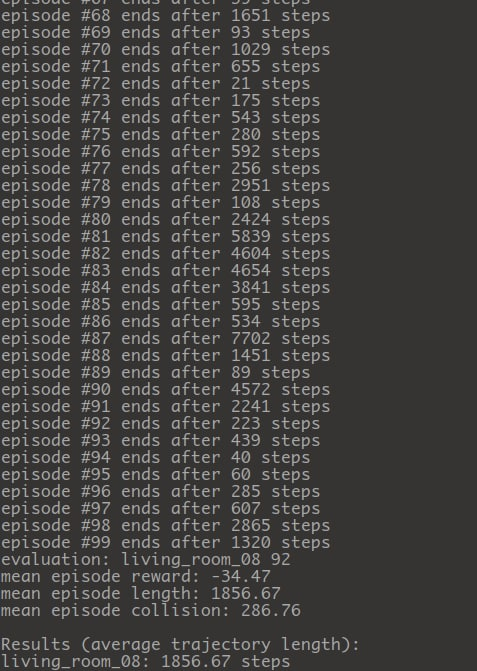

## Target-driven Visual Navigation Model using Deep Reinforcement Learning


## Introduction

This repocitory provides a Tensorflow implementation of the deep siamese actor-critic model for indoor scene navigation introduced in the following paper:

**[Target-driven Visual Navigation in Indoor Scenes using Deep Reinforcement Learning](http://web.stanford.edu/~yukez/papers/icra2017.pdf)**
<br>
[Yuke Zhu](http://web.stanford.edu/~yukez/), Roozbeh Mottaghi, Eric Kolve, Joseph J. Lim, Abhinav Gupta, Li Fei-Fei, and Ali Farhadi
<br>
[ICRA 2017, Singapore](http://www.icra2017.org/)
## Environment
It runs successfully on my machine.


- Architecture: `x86_64`
- Model Name: `Intel i7-8750H CPU @ 2.20GHz`
- OS: `Ubuntu 2004`
- software environment: `Conda 4.9.2`
- device :`CPU only`

use conda or py-venv

Here is a conda package list 
```bash
# Name                    Version                   Build  Channel
_libgcc_mutex             0.1                        main  
_openmp_mutex             5.1                       1_gnu  
_tflow_select             2.3.0                       mkl  
absl-py                   0.15.0             pyhd3eb1b0_0  
astor                     0.7.1                    py35_0  
blas                      1.0                         mkl  
ca-certificates           2022.4.26            h06a4308_0  
certifi                   2020.6.20          pyhd3eb1b0_3  
cycler                    0.10.0                   pypi_0    pypi
decorator                 5.1.1                    pypi_0    pypi
gast                      0.5.3              pyhd3eb1b0_0  
grpcio                    1.12.1           py35hdbcaa40_0  
h5py                      2.10.0                   pypi_0    pypi
imageio                   2.0.1                    pypi_0    pypi
intel-openmp              2022.0.1          h06a4308_3633  
kiwisolver                1.1.0                    pypi_0    pypi
libffi                    3.3                  he6710b0_2  
libgcc-ng                 11.2.0               h1234567_1  
libgfortran-ng            7.5.0               ha8ba4b0_17  
libgfortran4              7.5.0               ha8ba4b0_17  
libgomp                   11.2.0               h1234567_1  
libprotobuf               3.6.0                hdbcaa40_0  
libstdcxx-ng              11.2.0               h1234567_1  
markdown                  2.6.11                   py35_0  
matplotlib                3.0.3                    pypi_0    pypi
mkl                       2022.0.1           h06a4308_117  
ncurses                   6.3                  h5eee18b_3  
networkx                  2.4                      pypi_0    pypi
numpy                     1.18.5                   pypi_0    pypi
openssl                   1.1.1p               h5eee18b_0  
pillow                    7.2.0                    pypi_0    pypi
pip                       10.0.1                   py35_0  
protobuf                  3.6.0            py35hf484d3e_0  
pyglet                    1.5.26                   pypi_0    pypi
pyparsing                 2.4.7                    pypi_0    pypi
python                    3.5.6                h12debd9_1  
python-dateutil           2.8.2                    pypi_0    pypi
pywavelets                1.1.1                    pypi_0    pypi
readline                  8.1.2                h7f8727e_1  
scikit-image              0.15.0                   pypi_0    pypi
scipy                     1.4.1                    pypi_0    pypi
setuptools                40.2.0                   py35_0  
six                       1.16.0             pyhd3eb1b0_1  
sqlite                    3.38.5               hc218d9a_0  
tensorboard               1.10.0           py35hf484d3e_0  
tensorflow                1.10.0          mkl_py35heddcb22_0  
tensorflow-base           1.10.0          mkl_py35h3c3e929_0  
termcolor                 1.1.0                    py35_1  
tk                        8.6.12               h1ccaba5_0  
werkzeug                  1.0.1              pyhd3eb1b0_0  
wheel                     0.37.1             pyhd3eb1b0_0  
xz                        5.2.5                h7f8727e_1  
zlib                      1.2.12               h7f8727e_2  

```
`Note:`
Package,**pyglet**, is `incompatible` with python3.5.I have not fixed it tentatively.
## Setup
This code is implemented in [Tensorflow API r1.0](https://www.tensorflow.org/api_docs/). You can follow the [online instructions](https://www.tensorflow.org/install/) to install Tensorflow 1.0. Other dependencies ([h5py](http://www.h5py.org/), [numpy](http://www.numpy.org/), [scikit-image](http://scikit-image.org/), [pyglet](https://bitbucket.org/pyglet/pyglet/wiki/Home)) can be install by [pip](https://pypi.python.org/pypi/pip): ```pip install -r requirements.txt```. This code has been tested with Python 2.7 and 3.5.

## Scenes
To facilitate training, we provide [hdf5](http://www.h5py.org/) dumps of the simulated scenes. Each dump contains the agent's first-person observations sampled from a discrete grid in four cardinal directions. To be more specific, each dump stores the following information row by row:

* **observation**: 300x400x3 RGB image (agent's first-person view)
* **resnet_feature**: 2048-d [ResNet-50](https://arxiv.org/abs/1512.03385) feature extracted from the observations
* **location**: (x, y) coordinates of the sampled scene locations on a discrete grid with 0.5-meter offset
* **rotation**: agent's rotation in one of the four cardinal directions, 0, 90, 180, and 270 degrees
* **graph**: a state-action transition graph, where ```graph[i][j]``` is the location id of the destination by taking action ```j``` in location ```i```, and ```-1``` indicates collision while the agent stays in the same place.
* **shortest_path_distance**: a square matrix of shortest path distance (in number of steps) between pairwise locations, where ```-1``` means two states are unreachable from each other.

Before running the code, please download the scene dumps using the following script:
```bash
./data/download_scene_dumps.sh
```
We are currently releasing one scene from each of the four scene categories, *bathroom*, *bedroom*, *kitchen*, and *living room*. Please contact me for information about additional scenes.
A ```keyboard_agent.py``` script is provided. This script allows you to load a scene dump and use the arrow keys to navigate a scene. To run the script, here is an example command:
```bash
# make sure the scene dump is in the data folder, e.g., ./data/bedroom_04.h5
python keyboard_agent.py --scene_dump ./data/bedroom_04.h5
```

These scene dumps enable us to train a (discrete) navigation agent without running the simulator during training or extracting ResNet features. Thus, it greatly improves training efficiency. The training code runs comfortably on CPUs (of my Macbook Pro). Due to legal concerns, our THOR simulator will be released later.

## Training and Evaluation
The parameters for training and evaluation are defined in ```constants.py```. The most important parameter is ```TASK_LIST```, which is a dictionary that defines the scenes and targets to be trained and evaluated on. The keys of the dictionary are scene names, and the values are a list of location ids in the scene dumps, i.e., navigation targets. We use a type of asynchronous advantage actor-critic model, similar to [A3C](https://arxiv.org/abs/1602.01783), where each thread trains for one target of one scene. Therefore, make sure the number of training threads ```PARALLEL_SIZE``` is *at least* the same as the total number of targets. You can use more threads to further parallelize training. For instance, when using 8 threads to train 4 targets, 2 threads will be allocated to train each target.

The model checkpoints are stored to ```CHECKPOINT_DIR```, and Tensorboard logs are written in ```LOG_FILE```. To train a target-driven navigation model, run the following script:
```bash
# train a model for targets defined in TASK_LIST
python train.py
```

For evaluation, we run 100 episodes for each target and report the mean/stddev length of the navigation trajectories. To evaluate a model checkpoint in ```CHECKPOINT_DIR```, run the following script:
```bash
# evaluate a checkpoint on targets defined in TASK_LIST
python evaluate.py
```

## Acknowledgements
I would like to acknowledge the following references that have offered great help for me to implement the model.
* ["Asynchronous Methods for Deep Reinforcement Learning", Mnih et al., 2016](https://arxiv.org/abs/1602.01783)
* [David Silver's Deep RL course](http://www0.cs.ucl.ac.uk/staff/d.silver/web/Teaching.html)
* [muupan's async-rl repo](https://github.com/muupan/async-rl/wiki)
* [miyosuda's async_deep_reinforce repo](https://github.com/miyosuda/async_deep_reinforce)

## Citation
Please cite our ICRA'17 paper if you find this code useful for your research.
```
@InProceedings{zhu2017icra,
  title = {{Target-driven Visual Navigation in Indoor Scenes using Deep Reinforcement Learning}},
  author = {Yuke Zhu and Roozbeh Mottaghi and Eric Kolve and Joseph J. Lim and Abhinav Gupta and Li Fei-Fei and Ali Farhadi},
  booktitle = {{IEEE International Conference on Robotics and Automation}},
  year = 2017,
}
```

## License
MIT
